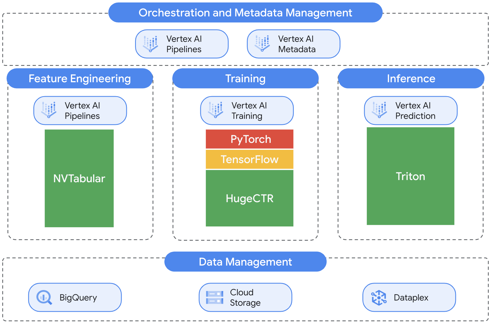
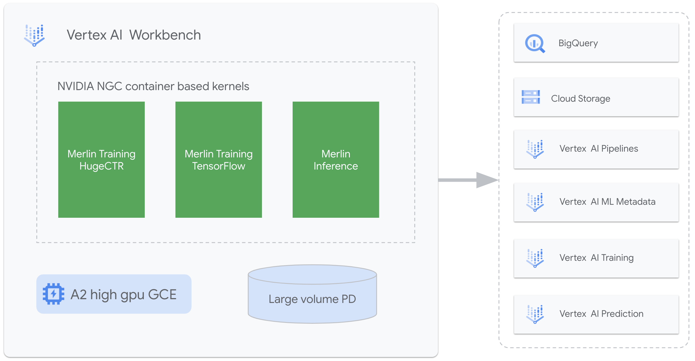

# NVIDIA Merlin on Vertex AI

This repository compiles prescriptive guidance and code samples for operationalization of [NVIDIA Merlin framework](https://developer.nvidia.com/nvidia-merlin) on [Google Cloud Vertex AI](https://cloud.google.com/vertex-ai).

[NVIDIA Merlin](https://developer.nvidia.com/nvidia-merlin) is an open-source framework for building large-scale deep learning recommender system. [Vertex AI](https://cloud.google.com/vertex-ai) is Google Cloud's unified Machine Learning platform to help data scientists and machine learning engineers increase experimentation, deploy faster, and manage models with confidence. Using NVIDIA Merlin with Vertex AI enables developers to build, train and deploy custom end-to-end recommender systems at scale, within Vertex AI’s unified and fully-managed  MLOps platform.

The content in this repository centers around five core scenarios:

- Setting up Merlin experimentation and development environment in [Vertex AI Workbench](https://cloud.google.com/vertex-ai-workbench). 
- Operationalizing large scale data preprocessing pipelines with [NVIDIA Merlin NVTabular](https://developer.nvidia.com/nvidia-merlin/nvtabular) and [Vertex AI Pipelines](https://cloud.google.com/vertex-ai/docs/pipelines/introduction).
- Training large-scale deep learning ranking models with [NVIDIA Merlin HugeCTR](https://developer.nvidia.com/nvidia-merlin/hugectr) and [Vertex AI Training](https://cloud.google.com/vertex-ai/docs/training/custom-training).
- Deploying models and serving predictions with [NVIDIA Triton Inference Server](https://developer.nvidia.com/nvidia-triton-inference-server) and [Vertex AI Prediction](https://cloud.google.com/vertex-ai/docs/predictions/getting-predictions)
- Implementing end to end data preprocessing, training, and deployment pipelines with [Vertex AI Pipelines](https://cloud.google.com/vertex-ai/docs/pipelines/introduction).

For detailed information about NVIDIA Merlin components and Vertex AI services, refer to [NVIDIA Merlin](https://developer.nvidia.com/nvidia-merlin) and [Vertex AI](https://cloud.google.com/vertex-ai) documentation. 

The dataset used by all samples in this repo is [Criteo 1TB Click Logs dataset](https://ailab.criteo.com/download-criteo-1tb-click-logs-dataset/) provided by [The Criteo AI Lab](https://ailab.criteo.com/about-us/). 


## Architecture Overview

The below figure summarizes a high level architecture of the solution demonstrated in this repo.




### Large scale data preprocessing

Commercial recommenders are trained on huge datasets, often several hundreds of terabytes in size. At this scale, data preprocessing steps often take much more time than training recommender machine learning models. [NVTabular](https://developer.nvidia.com/nvidia-merlin/nvtabular) - a core component of *Merlin* - is a feature engineering and preprocessing library designed to effectively manipulate terabytes of recommender system datasets and significantly reduce data preparation time. 

In this repo we demonstrate how to operationalize NVTabular data preprocessing workflows using Vertex AI Pipelines and multi-GPU processing nodes. The repo includes two samples of reusable and customizable data preprocessing pipelines developed using [Kubeflow Pipelines SDK](https://www.kubeflow.org/docs/components/pipelines/sdk/sdk-overview/) and [Google Cloud pipeline components](https://cloud.google.com/vertex-ai/docs/pipelines/build-pipeline#google-cloud-components). 

The first pipeline demonstrates how to process large CSV datasets managed in [Google Cloud Storage](https://cloud.google.com/storage). The second pipeline digests source data from [Google BigQuery](https://www.google.com/search?q=bigquery&oq=bigquery&aqs=chrome..69i57j0i512l9.1610j0j15&sourceid=chrome&ie=UTF-8)

### Training large-scale deep learning recommender models

[Merlin HugeCTR](https://github.com/NVIDIA-Merlin/HugeCTR) is NVIDIA's GPU-accelerated, highly scalable recommender framework. NVIDIA HugeCTR facilitates  implementations of leading deep learning recommender models such as [Google's Wide and Deep](https://arxiv.org/abs/1606.07792) and, [Facebook's DLRM](https://arxiv.org/abs/1703.04247).

The repo includes an example of how to operationalize training and hyperparameter of the HugeCTR implementation of the [DeepFM](https://arxiv.org/abs/1703.04247) model using [Vertex AI Training](https://cloud.google.com/vertex-ai/docs/training/custom-training) and massively scalable [A2 Virtual Machines](https://cloud.google.com/blog/products/compute/a2-vms-with-nvidia-a100-gpus-are-ga), powered by NVIDIA A100 GPUs.

### Deploying and serving deep learning ranking inference pipelines 

[NVIDIA Triton Inference Server](https://developer.nvidia.com/nvidia-triton-inference-server) is an open-source inference serving software that can deploy and serve trained AI models from any framework on both CPUs and GPUs. Triton supports ensemble models that can be used to implement multi-step inference pipelines. 

The repo includes a sample that demonstrates how to create, deploy, and serve a Triton ensemble model using Vertex AI Prediction. The example ensemble implements an inference pipeline that integrates NVTabular data preprocessing workflow with a HugeCTR deep learning model. 

### End to end MLOps workflow

Design patterns and best practices outlined in the previous sections come together in the last component of the solution - a reference implementation of the machine learning pipeline that integrates data preprocessing, training, and deployment into a unified end to end workflow.

### Experimentation and development environment

A flexible and powerful experimentation and development environment is critical in recommender system projects. In the environment setup section of this repo we outline steps to configure the environment depicted on the below figure. 



The environment is based on [Vertex AI Workbench](https://cloud.google.com/vertex-ai/docs/workbench/introduction). Container images based on NVIDIA NGC [Merlin training](https://catalog.ngc.nvidia.com/orgs/nvidia/teams/merlin/containers/merlin-training) and [Merlin inference](https://catalog.ngc.nvidia.com/orgs/nvidia/teams/merlin/containers/merlin-inference) images are installed as managed notebooks kernels augmenting the standard features of a managed notebook instance that include UI and programmatic interfaces to Google Cloud services.


## Repository structure

The core content of the repository comprises of a series of Jupyter notebooks and a set of Python modules. The notebooks compile detailed guidance on implementing the  solution's components described at a high level in the previous section. The Python modules encapsulate reusable code components that are used in the notebooks and in Vertex AI jobs and pipelines. 

Currently, the repo includes the following notebooks:

1. [00-dataset-management](00-dataset-management.ipynb) - describes and explores the Criteo dataset, and loads it to BigQuery.
2. [01-dataset-preprocessing](01-dataset-preprocessing.ipynb) - guidance for large-scale data preprocessing with NVTabular and Vertex Pipelines
3. [02-model-training-hugectr](02-model-training-hugectr.ipynb) - guidance for training HugeCTR models with Vertex Training. 
4. [03-model-inference-hugectr](03-model-inference-hugectr.ipynb) - guidance for deploying Trition ensemble models with Vertex Prediction
5. [04-e2e-pipeline](04-e2e-pipeline.ipynb) - guidance for building an end-to-end data preprocessing, training, and deployment pipeline

The Python modules are in the `src` folder:
- `src/pipelines` - pipeline and pipeline components definitions
- `src/preprocessing` - data preprocessing utility functions and classes
- `src/serving` - deployment and serving utility functions and classes
- `src/training` - model definitions and training loops

The `src` folder also includes Dockerfiles for custom container images used by Vertex Pipelines, Vertex Training, and Vertex Prediction. Refer to the notebooks for more detailed information.


## Environment setup

This section outlines the steps to configure a GCP environment required to run the code samples in this repo.  
The folder `env-config` contains a Dockerfile used to create a kernel on Vertex AI Workbench to run the code samples.

### Select a Google Cloud project

In the Google CLoud Console, on the project selector page, [select or create a Google Cloud project](https://console.cloud.google.com/projectselector2/home/dashboard?_ga=2.77230869.1295546877.1635788229-285875547.1607983197&_gac=1.82770276.1635972813.Cj0KCQjw5oiMBhDtARIsAJi0qk2ZfY-XhuwG8p2raIfWLnuYahsUElT08GH1-tZa28e230L3XSfYewYaAlEMEALw_wcB).

### Enable the required services

From [Cloud Shell](https://cloud.google.com/shell/docs/using-cloud-shell), run the following `gcloud` command to enable the required Cloud APIs:
```
PROJECT_ID=<YOUR PROJECT ID>
gcloud services enable \
    aiplatform.googleapis.com         \
    bigquery.googleapis.com           \
    bigquerystorage.googleapis.com    \
    cloudapis.googleapis.com          \
    cloudbuild.googleapis.com         \
    compute.googleapis.com            \
    containerregistry.googleapis.com  \
    notebooks.googleapis.com          \
    storage.googleapis.com            \
    --project=${PROJECT_ID}
```

### Creating a staging GCS bucket

The notebooks in the repo require access to a GCS bucket that is used for staging and managing ML artifacts created by the workflows implemented in the notebooks. The bucket should be in the same GCP region as the region you will use to run Vertex AI jobs and pipelines.

From [Cloud Shell](https://cloud.google.com/shell/docs/using-cloud-shell), run the following command to create the bucket:

```
REGION=<YOUR REGION>
BUCKET_NAME=<YOUR BUCKET_NAME>
gsutil mb -l $REGION gs://$BUCKET_NAME
```

### Building Merlin development container image

To run the notebooks in this repo you will use a custom container image that will be configured as a Vertex AI Workbench managed notebooks kernel. The image is a based on the NVIDIA NGC Merlin training image augmented with additional packages required to interface with Vertex AI.

From [Cloud Shell](https://cloud.google.com/shell/docs/using-cloud-shell), run the following command to create the container image:

1. Get Dockerfile for the Merlin development image:
```
git clone https://github.com/GoogleCloudPlatform/nvidia-merlin-on-vertex-ai
cd nvidia-merlin-on-vertex-ai/env-config
```

2. Build and push the development image
```
PROJECT_ID=<YOUR PROJECT ID> # change to your project id.
IMAGE_URI=gcr.io/${PROJECT_ID}/merlin-vertex-dev
gcloud builds submit --timeout "2h" --tag ${IMAGE_URI} . --machine-type=e2-highcpu-8
```

### Creating and configuring an instance of Vertex Workbench managed notebook

This section provides steps for provisioning a Vertex AI Workbench managed notebook and configuring a custom kernel based on the image created in the previous step.  
**IMPORTANT**: Make sure you are following these steps on the same project as before.

1. Start the creation of a Managed Notebook in Workbench following the instructions in the [Create a managed notebooks instance how-to guide](https://cloud.google.com/vertex-ai/docs/workbench/managed/create-instance):
2. In `Permission`, choose `Service Account` and `Compute Engine default service account` as the authentication method.
3. Open the `Advanced Options`.
4. In `Environment > Custom docker images` [(Use custom Docker images settings)](https://cloud.google.com/vertex-ai/docs/workbench/managed/create-instance#use_custom_docker_images) enter a name of the image you created in the previous step: `gcr.io/<your-project-id>/merlin-vertex-dev:latest`
5. In `Hardware configuration` [(Configure hardware settings)](https://cloud.google.com/vertex-ai/docs/workbench/managed/create-instance#configure_hardware) select your GPU configuration. We recommend a machine with two `NVIDIA Tesla T4` or `NVIDIA Tesla A100` GPUs. 
5.1. Make sure you selected the option `Install NVIDIA GPU driver automatically for me`.
7. In `Idle shutdown`, uncheck this option.
8. In `Security`, check `Enable Terminal`.
9. Click `Create`.

### Install the samples
After the Vertex Workbench managed notebook is created, peform the following steps:

1. Click on the OPEN JUPYTERLAB link on the notebook instance.
2. Click on the New Launcher button, then start a new terminal session.
3. Clone the repository to your notebook instance:
```
git clone https://github.com/GoogleCloudPlatform/nvidia-merlin-on-vertex-ai
cd nvidia-merlin-on-vertex-ai
```
4. Wait for the Kernel to finish loading. You can follow the status of this task in the `Activity Log` on the right side panel.
5. Follow the instructions on the notebooks provided in this repository. Make sure you are executing these notebooks with the newly installed kernel (merlin-vertex-dev).

If you have any question or if you found any problem with this repository, please file a bug in this page.
